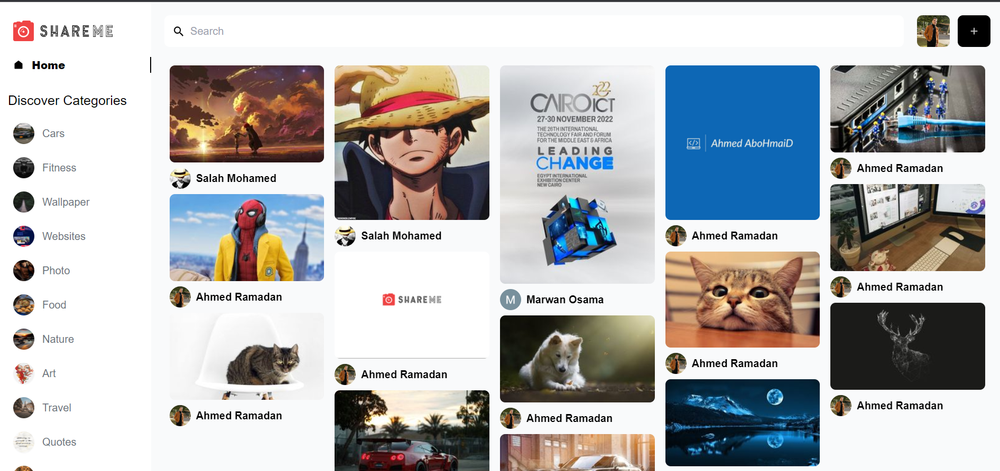
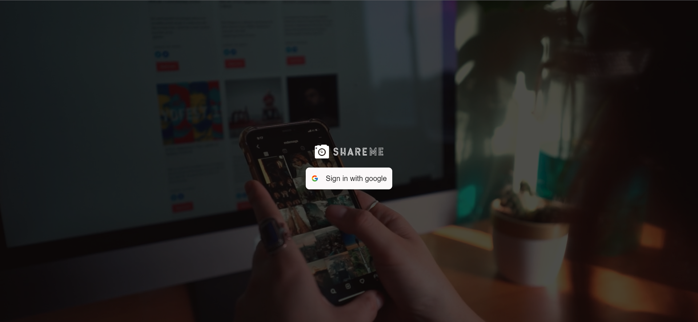
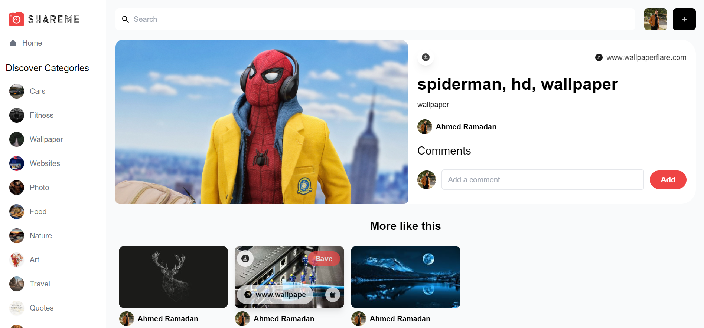
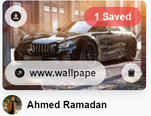
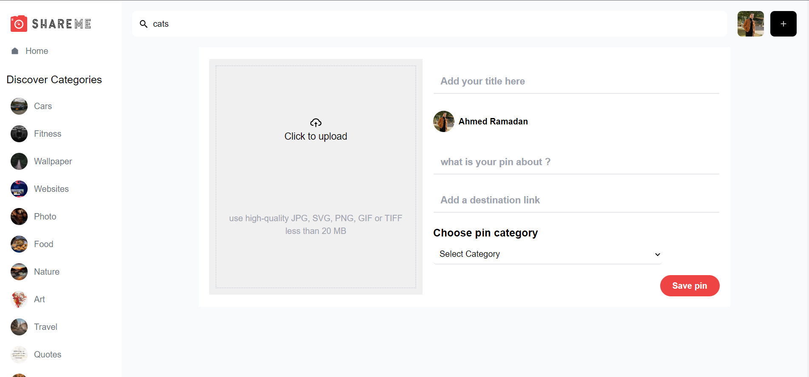
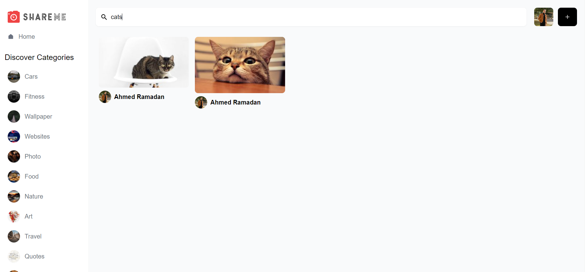
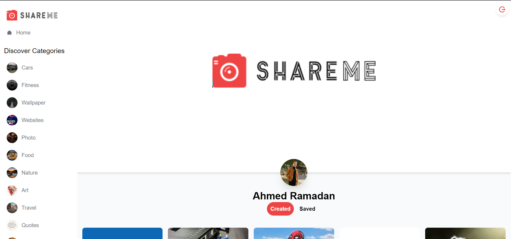

<h1 align="center"> ⚡Shareme 'Social Media App'⚡</h1>

 

## Live : [Shareme](https://shareme-abohmaid.netlify.app)

---

## ⚡About App⚡:

### Home Page

---

### Login Page
Using google authenticator

---

### Details for the image with images like it

---

### Download, delete, save and go to pin destination

---

### Upload image

---

### Smart search

---

### Profile page with Logout

---

## Live : [Shareme](https://shareme-abohmaid.netlify.app)

---

## ⚡Technologies⚡

### Front-End:
_JavaScript
 
_React.js
 
_Tailwind CSS
 
_Material UI
 
_Google Authenticator

### Back-End:
_Sanity

---
## ⚡Resources⚡

### Documentation:

- [Create-react-app Documentation](https://reactjs.org/docs/create-a-new-react-app.html)
- [React Router Documentation](https://reactrouter.com/en/main)
- [MUI](https://mui.com/)
- [React icons](https://react-icons.github.io/react-icons)
- [Sanity](https://www.sanity.io/)
- [Google cloud](https://console.cloud.google.com)

---
<h2 align="center" id="contact">⚡️ How to reach me ⚡️</h2>
  

    <a href="mailto:ahmedmedo.am121212@gmail.com"></img></a>
    
    
    <a h
